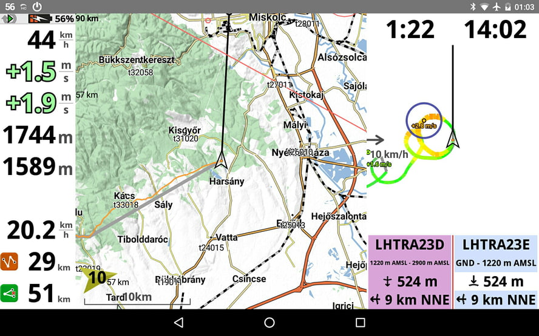
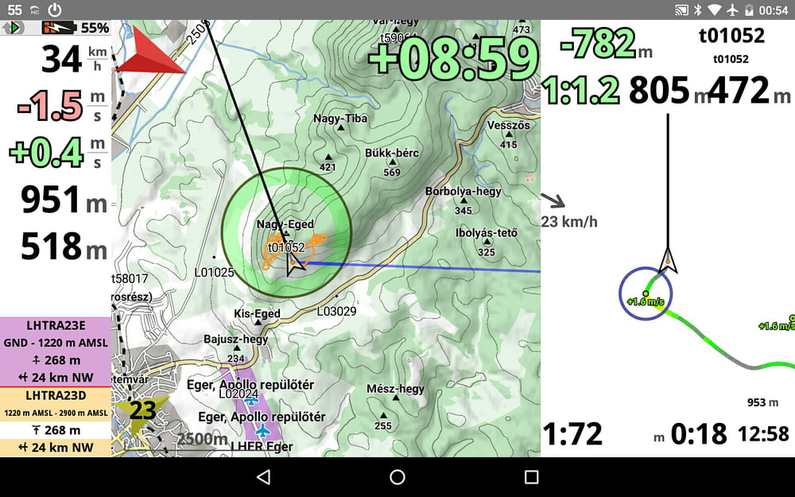

# hyperknot's XCTrack Config

My up-to-date XCTrack configuration files.

## How to import them.

1. Go to **Preferences / Testing & Debug**
2. Click **Export configuration**, just to create the directory
3. Download the chosen file into the **XCTrack/Config** folder
4. Click **Import configuration**

## Landscape

Optimised for a Nexus 7 2013 tablet, in landscape mode. 

[Download](https://gitcdn.link/repo/hyperknot/xctrack-config/master/screens/hyperknot-landscape.cfg)

#### XC mode

#### Competition mode

## Portrait

Optimised for a small screen Moto G phone, in portrait mode. 

[Download](https://gitcdn.link/repo/hyperknot/xctrack-config/master/screens/hyperknot-portrait.cfg)

## QR code to this URL

